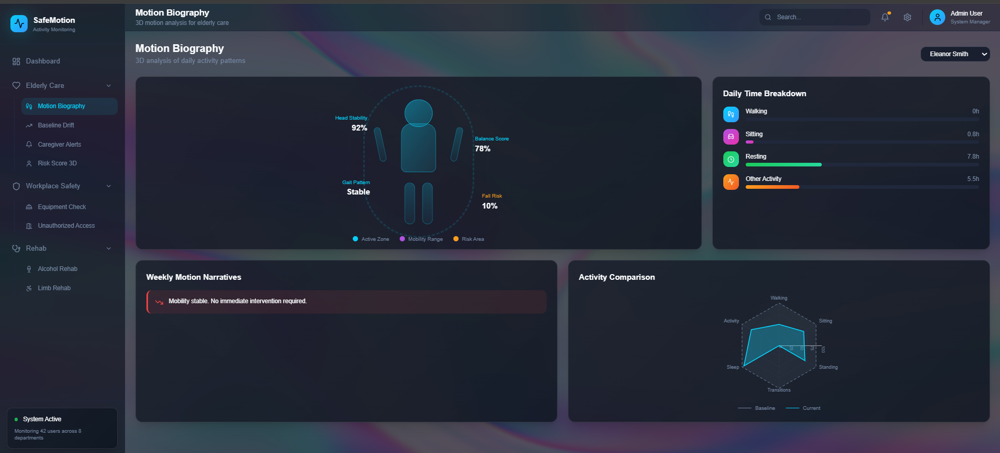
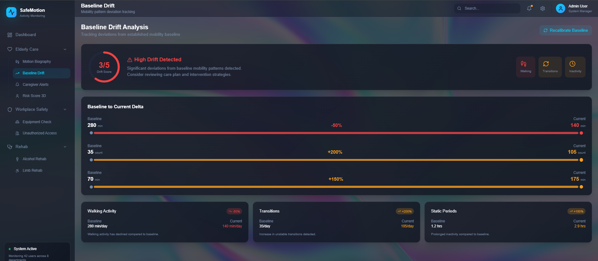
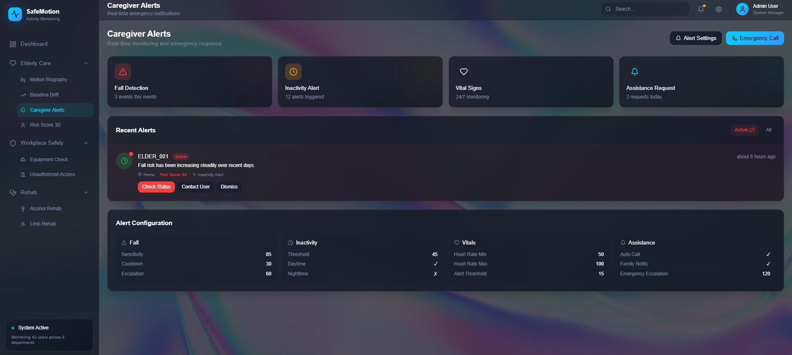
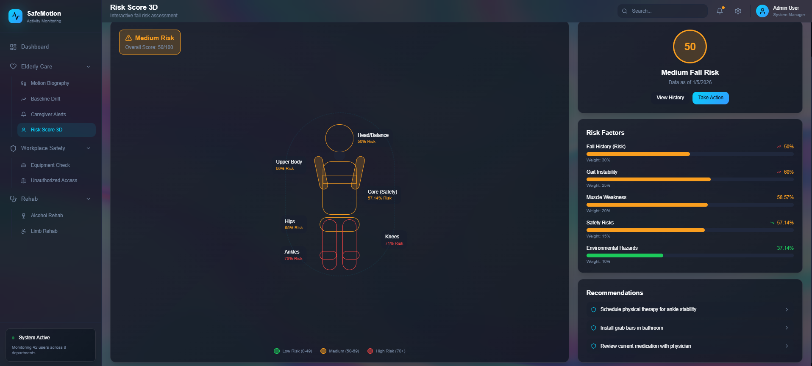
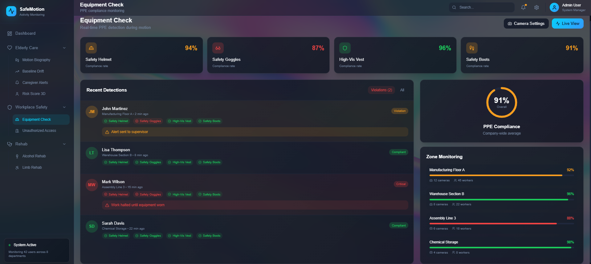
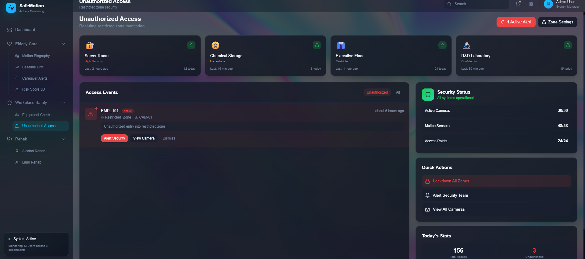
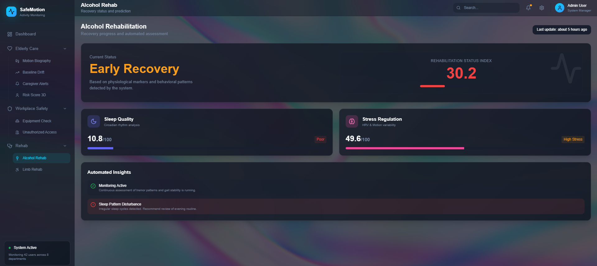
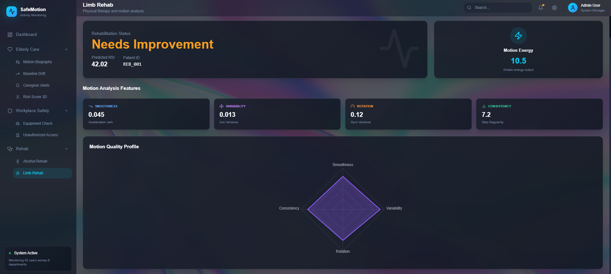

# Ecoverse_Team16
# 🛡️ SafeMotion – AI-Driven Activity Monitoring & Safety Intelligence Platform

SafeMotion is a unified AI-powered activity monitoring platform designed for elderly care, workplace safety, and rehabilitation monitoring.

It combines human activity recognition, risk analytics, predictive models, and real-time alerts into a single, modular system backed by Firebase and ML inference pipelines.  
The platform interprets the same motion data differently based on user context (Elderly, Employee, Rehab), enabling healthcare intelligence and safety compliance using one scalable backend.

---

## 🚀 Key Highlights

- 🔹 Context-aware activity interpretation (Elderly / Workplace / Rehab)
- 🔹 Motion Biography & Baseline Drift analysis
- 🔹 AI-based fall risk & safety scoring
- 🔹 Real-time caregiver & supervisor alerts
- 🔹 Rehabilitation Status Index (RSI) prediction
- 🔹 Firebase-backed real-time data storage
- 🔹 Modular backend architecture (ML + rules + analytics)
- 🔹 Dashboard-ready outputs for enterprise UI

---

## 🎯 Project Objectives

- Detect and analyze human activities from motion data  
- Monitor elderly mobility decline & fall risk  
- Track baseline drift in daily activity patterns  
- Generate caregiver alerts with severity & recommendations  
- Enforce workplace safety & access compliance  
- Predict rehabilitation recovery status  
- Centralize all outputs in Firebase for real-time dashboards  

---

## 🧠 System Architecture (High-Level)

```
Motion / Activity Data
        ↓
Context Engine (Role-Based Interpretation)
        ↓
┌───────────────────────────────┐
│ Elderly Care  │ Workplace │ Rehab │
└───────────────────────────────┘
        ↓
Risk Scoring | Drift Analysis | ML Inference
        ↓
Firebase (Firestore)
        ↓
Admin / Caregiver / Supervisor Dashboards
```

---

## 📊 Core Functional Modules

### 👴 Elderly Care
- Motion Biography (daily & weekly trends)
- Baseline Drift detection
- Caregiver alerts
- Fall risk & 3D risk scoring

### 🏭 Workplace Safety
- Restricted zone monitoring
- PPE & equipment compliance
- Unauthorized access detection
- Safety score & escalation logic

### 🧠 Rehabilitation
- Limb rehabilitation RSI prediction
- Alcohol rehabilitation status index
- Sleep & stress-based recovery modeling

---

## 🖥️ Dashboard Screens & Explanations

Screenshots are stored inside the `assets/` folder.

### 🧍 Motion Biography – Elderly Care

<p align="center">
  
</p>

Visualizes daily mobility patterns, balance, gait stability, and fall risk using aggregated motion analytics.

---

### 📉 Baseline Drift Analysis

<p align="center">
  
</p>

Tracks deviations from a user’s established mobility baseline to detect gradual health decline.

---

### 🚨 Caregiver Alerts

<p align="center">
  
</p>

Generates prioritized alerts with severity levels and actionable recommendations for caregivers.

---

### 🧍‍♂️ Risk Score 3D (Fall Risk Assessment)

<p align="center">
  
</p>

Provides a body-part–wise 3D fall risk visualization for targeted intervention planning.

---

### 🦺 Equipment Check – Workplace Safety

<p align="center">
  
</p>

Monitors PPE compliance (helmet, goggles, vest, boots) and flags violations in real time.

---

### 🔐 Unauthorized Access Monitoring

<p align="center">
  
</p>

Detects and logs unauthorized entry into restricted or hazardous workplace zones.

---

### 🍺 Alcohol Rehabilitation Monitoring

<p align="center">
  
</p>

Predicts rehabilitation recovery stage using sleep quality and stress regulation models.

---

### 🦵 Limb Rehabilitation Analysis

<p align="center">
  
</p>

Evaluates limb recovery using motion smoothness, consistency, and energy-based ML features.

---

## 🗂️ Project Structure

```
ECOVERSE_TEAM16/
│
├── assets/                         # Dashboard screenshots
├── models/                         # Trained ML models (PKL)
├── notebooks/                      # Training & experimentation
│
├── src/
│   ├── elderly/
│   │   ├── motion_biography.py
│   │   ├── baseline_drift.py
│   │   └── caregiver_alerts.py
│   │
│   ├── workplace/
│   │   └── workplace_safety.py
│   │
│   ├── rehab/
│   │   ├── limb_rehab.py
│   │   └── rehabilitation_alcoholic_index.py
│   │
│   ├── integration/
│   │   └── context_engine.py
│   │
│   ├── risk/
│   │   └── risk_scoring.py
│   │
│   └── utils/
│       ├── firebase_client.py
│       └── logger.py
│
├── requirements.txt
├── README.md
└── .gitignore
```

---

## 🔥 Firebase Integration

- All outputs (alerts, scores, predictions) are pushed to Firestore  
- Enables real-time UI updates  
- Secure access via service account  

### Supports
- Elderly alerts  
- Workplace violations  
- Rehab predictions  
- Risk analytics  

---

## ⚙️ Setup & Execution

### 1️⃣ Install Dependencies

```bash
pip install -r requirements.txt
```

### 2️⃣ Configure Environment

```env
FIREBASE_SERVICE_ACCOUNT=path/to/serviceAccountKey.json
```

### 3️⃣ Run Individual Modules

```bash
python -m src.elderly.motion_biography
python -m src.elderly.baseline_drift
python -m src.elderly.caregiver_alerts
python -m src.workplace.workplace_safety
python -m src.rehab.limb_rehab
python -m src.rehab.rehabilitation_alcoholic_index
```

---

## 🧩 Technologies Used

- Python  
- Scikit-learn  
- Pandas / NumPy  
- Firebase (Firestore)  
- ML Pipelines (PKL-based models)  
- Rule-based Safety Engines  
- Real-time Dashboard Integration  

---

## 🎓 Learning Outcomes

- Context-aware AI system design  
- Elderly health analytics & fall risk modeling  
- Workplace safety intelligence  
- Rehabilitation prediction pipelines  
- Firebase-backed real-time systems  
- Scalable backend architecture for AI dashboards  

---

## 👨‍💻 Author

**Jeeva M**  
AI / ML Engineer  

**SafeMotion – Intelligent Activity Monitoring System**

---

## ⭐ Future Enhancements

- Live sensor streaming (Kafka / MQTT)
- Explainable AI for risk predictions
- Mobile caregiver app
- Multi-LLM narrative generation
- Cloud deployment (Docker + GCP/AWS)
